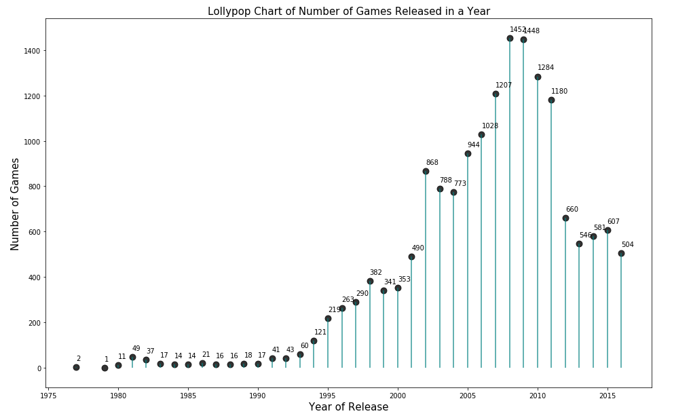
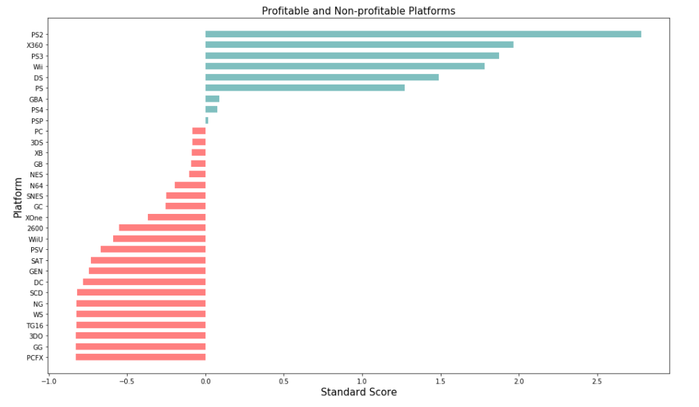

# Video Games Sales Data Analysis

   
 

## [Detailed Project Link](https://nbviewer.org/github/Emmanuel-Nti/video_games_sales_analysis/blob/master/Video_Games_Sales_Analysis_Nti.ipynb) 

## How I Approached the Project
- Importation of the data and libraries
- Preprocessed the data and carried out exploratory data analysis (categorized the products with machine learning algorithm)
- Analyzed the data
- Created user profile for each region
- Formulated and tested statistical hypotheses
- General conclusion

## Number of Games Released in a Year
The number of games released in a year peaked in 2008 and significantly started falling from 2010.

   
 

## Profitable and Non-profitable Platforms.
The PS2 platform is the most profitable plaform, the PCFX platform is the least non profitable plaform.

   
 

 
## General Findings
- Before 1994, there was no year that more than 100 games were released. However, from 1994 to 2016, more than 100 games have been released every year.
- PS, PS2, and Nintendo DS used to be popular platforms but now have zero sales.
- Generally, it takes about a year or less for new platforms to appear. On average, old plaforms take about 8 years to fade.
- Atari 2600 platform existed for the longest number of years (35 years)
- Since 2010, the most profitable platforms are PS3, 3DS, DS, PC, PS4, Wii, X360, and XOne. In sum total, PS3 and X360 are leading in sales.
- In 2016, all plaforms had experienced their peak sales and started shrinking, but PS4, XOne, and 3DS were leading in sales.
- Since 2010, average sales on various platforms differed but not significantly different especially among the highest performing plaforms as average sales were all below $1 million. PS4 had the highest average sales of about $0.80 million, and GBA platform had about $0.05 million sales (the lowest).
- There is positive correlation between review of plaforms and sale of games.
- Generally, from 2010, Action genres have been the most profitable considering sum of total yearly sales. However,on average, the most profitable genre is Shooter. The least profitable game genre is Puzzle.
- PS3 and X360 platforms dominate sales in Europe and North American markets.
- Nintendo 3DS and PS3 dominates market share in Japan.
- PS3 platform is at least among top two dominant market share of games across Europe, North America, and Japan.
- Action and Shooter genres are dominating the market share of sales in Europe and North America while Role_Playing and Action dominates in Japan.
- Action genre is at least among the top two dominating genres across the three regions.
- ESRB ratings affect sales in individual regions.
- Average user ratings of the Xbox One and PC platforms are the same.
- Average user ratings for Action and Sports genres are different.

## Libraries Used
- Pandas 
- Numpy 
- Scipy 
- Seaborn
- Matplotlib
- Requests

